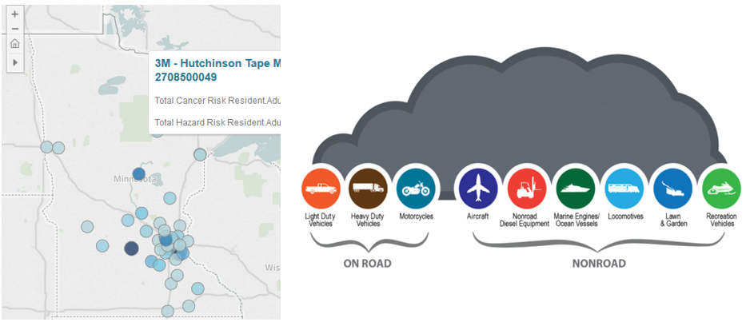
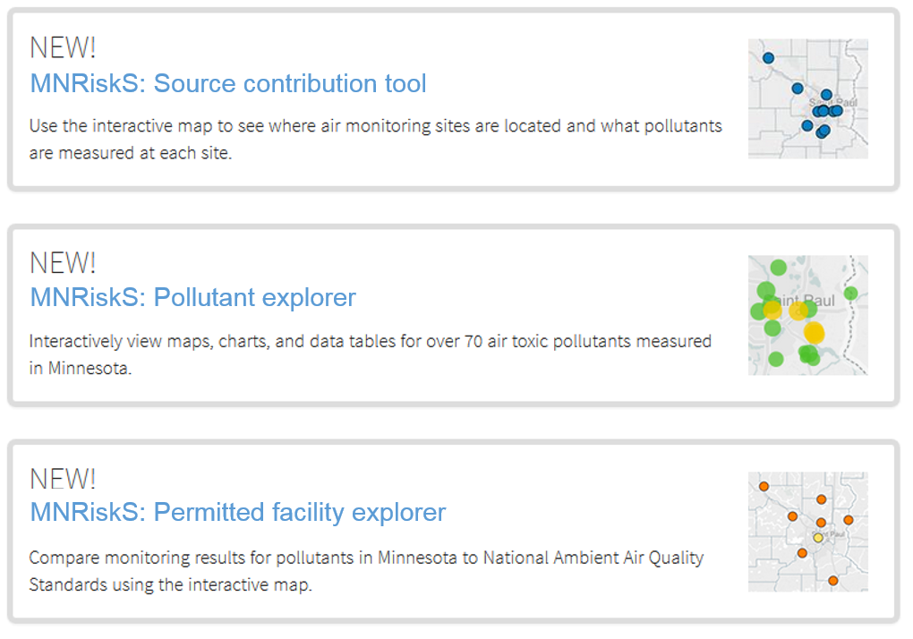

# MNRisk  
•	Overview  
•	Maps and results  
•	Assumptions / uncertainties  
•	Methods  
•	Frequent questions  
•	Contacts  

> It's not possible to monitor everywhere, nor everything. -Dr. Pratt

_MNRisk_ is an essential tool for understanding air pollution in Minnesota. MNRisk aims to better understand cumulative air pollution risks in Minnesota by identifying communities where concentrations of pollutants are elevated, and which sources are contributing the most to pollution in those areas. To capture the potential for air quality concerns across the entire state of Minnesota the modeling performed for MNRisk includes permitted facilities, as well as all other emission sources in the statewide air emissions inventory. These emission sources include dispersed sources such as:  

- __Residential:__  Home heating, open burning, backyard fires, lawn-care, cleaning products
-	__Commercial & Industrial:__  Boilers, diesel equipment, dry cleaners, gas stations, construction 
-	__Transportation:__  Passenger cars, diesel trucks, buses, airports, railroads, recreational vehicles

__MNRisk sources__  

## Maps and results

_MNRisk_ results are used to conduct risk-based prioritizations such as comparing impacts from source types or industrial sectors; identifying communities where specific chemicals are a concern; or comparing the differences in impacts of possible interventions or proposed policy changes in an area of Minnesota.  

Applications of _MNRisk_ include:    
1.	Providing a picture of cumulative background air pollution concentrations and risks.  
1.	Prioritizing pollutants for future work according to air concentrations and health risks.  
1.	Prioritizing individual sources and categories based on air concentrations and health risks.  
1.	Evaluating the placement of air monitors.  
1.	Identifying the effects of potential future changes in emissions due to policy, program initiatives or changes to facilities.  

__Updates:__ Modeling results are updated along with EPA's national emissions inventory data every three years. Current results are based on EPA’s emission inventory for calendar year 2011. Updated results using 2014 emissions are expected to be available in 2017, shortly after EPA releases the finalized national emissions inventory. 

## Assumptions and uncertainties

•	Estimates of risk are uncertain.

## Methods and documentation

The _MNRiskS_ technical support document provides...

## Frequent questions

What weather data did you use?
What is a hazard index?
Is the receptor location me? 

## Contacts
