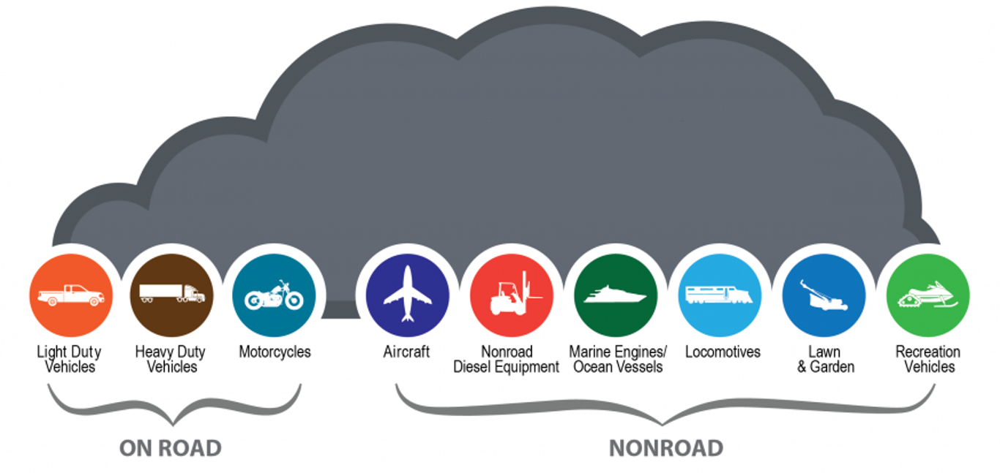

# MnRiskS

Potential air quality and health risks are modeled across the entire state of Minnesota for all permitted facilities and emission sources in EPA's emission inventory. Detailed modeling results are available here.

The MNRiskS tool is the outcome of the work to better understand cumulative air pollution risks in Minnesota.  
It was later updated with new emissions data every three years, including 2002, 2005, 2008, and 2011.  
The emission inventory includes the following source types:  

1.	Point sources  
2.	Non-point (area)  
3.	Mobile (on-road and non-road)  

__Mobile sources__

MNRiskS has become an essential tool in understanding air pollution in Minnesota, and is used in a number of ways by MPCA programs:  

1.	Providing a picture of cumulative background air pollution concentrations and risks against which to evaluate potential changes.  
2.	Focusing and refining the air emissions inventory.  
3.	Identifying and prioritizing pollutants for future work according to air concentrations and health risks.  
4.	Identifying and prioritizing individual sources and source categories for future work based on air concentrations and health risks.  
5.	Comparing modeled concentrations with monitoring data to evaluate monitor siting and to quantify model uncertainties.  
6.	Providing information to focus MPCA air programs and resource allocation.   
7.	Identifying the effects of potential future changes in emissions due to policy or program initiatives or changes at specific facilities.  

## Results

## Methods & Documentation
